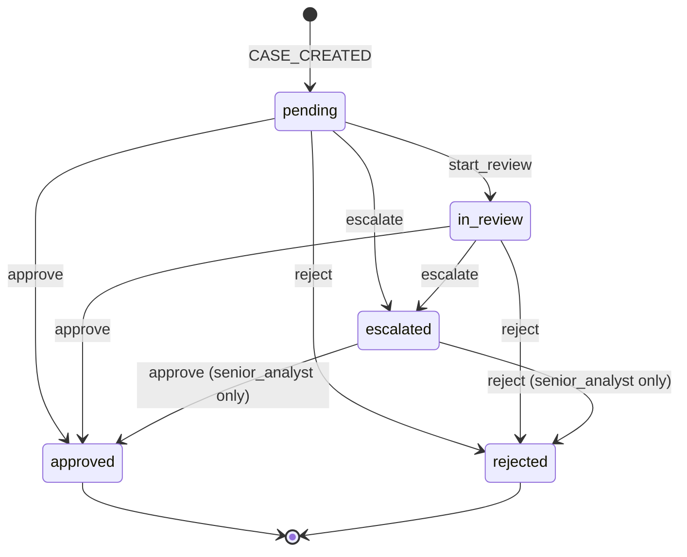

# KYC Review Console

Prototype internal tool for compliance analysts at a fictional Series C fintech. Analysts work a queue of KYC cases, inspect the customer profile and the risk signals that drove the score, and approve, reject or escalate each case; every decision is written to a tamper-evident audit trail. The project exists to evaluate whether Devin-built, version-controlled software can replace the company's Microsoft Power Apps internal tools. It is a prototype: see [`docs/ASSUMPTIONS.md`](docs/ASSUMPTIONS.md) for every shortcut taken and what production would require instead.

## Architecture

npm workspaces monorepo:

| Package | Role |
| --- | --- |
| `packages/server` | Express + better-sqlite3 API (TypeScript, ESM). Implements [`docs/API_CONTRACT.md`](docs/API_CONTRACT.md). Layered `http → services → domain (pure) → repo → SQLite`; see [`docs/ARCHITECTURE.md`](docs/ARCHITECTURE.md). |
| `packages/web` | Default UI: Vite + React 18 + react-router-dom SPA. Talks to the API over HTTP on `http://localhost:4000` (Vite proxies `/api/*`). |
| `variants/web-b`, `variants/web-c` | Alternative UI implementations evaluated during selection — see [`variants/README.md`](variants/README.md). |

### UI (`packages/web`)

Minimal SPA: a case queue at `/` and a case detail at `/cases/:id`, plain CSS, no UI kit or data-fetching library. The dev server runs on `http://localhost:5173` and proxies `/api/*` to the API on port 4000. The analyst identity is chosen from a header dropdown (persisted in localStorage) and sent as the `x-analyst-id` header. Production build emits `packages/web/dist/`.

Two alternative UIs were built and evaluated; they are kept as reference implementations under `variants/`:

- `variants/web-b` — component-library SPA: Tailwind CSS, shadcn-style primitives on Radix, TanStack Query + Table. Run: `npm run dev:web-b`.
- `variants/web-c` — server-rendered: Express SSR + React 19 + htmx on port 3000. Run: `npm run dev:web-c`.

web-a was selected as the default: same features, simplest stack, fewest dependencies.

## Prerequisites

- Node 20+ (`node -v`)
- npm 10 (`npm -v`) — workspaces support is required

## Setup and run

```bash
npm install          # installs all workspaces
npm run seed         # drop + recreate + populate packages/server/data/kyc.db (deterministic, idempotent)
npm run dev:server   # API on http://localhost:4000 (override with PORT)
npm run dev:web      # UI dev server on http://localhost:5173 (see UI section above)
```

Checks:

```bash
npm test             # vitest: server + web suites
npm run lint         # eslint: server + web
npm run typecheck    # tsc --noEmit: server + web
```

Per-variant equivalents exist for the alternative UIs (`npm run test:web-b`, `npm run typecheck:web-c`, etc.).

Environment variables (server): `PORT` (default `4000`), `KYC_DB_PATH` (default `packages/server/data/kyc.db`; `:memory:` supported).

Quick smoke test after `npm run dev:server`:

```bash
curl -s localhost:4000/api/health
curl -s 'localhost:4000/api/cases?riskLevel=high&pageSize=3'
curl -s -X POST localhost:4000/api/cases/<id>/actions \
  -H 'content-type: application/json' -H 'x-analyst-id: ana-003' \
  -d '{"action":"start_review"}'
```

## Analyst workflow

1. **Queue** — `GET /api/cases` lists cases with status, risk level, score and customer summary; `GET /api/cases/stats` feeds the header counters.
2. **Filter** — by `status`, `riskLevel` (multi-value), free-text `q` (reference, customer name, email), sorted by `createdAt`, `updatedAt` or `riskScore`.
3. **Open case** — `GET /api/cases/:id` returns the full customer record, the risk signals, the audit history and `allowedActions` for the calling analyst.
4. **Review customer + risk signals** — verification flags, PEP/sanctions/adverse media, expected volume, source of funds.
5. **Act** — `POST /api/cases/:id/actions` with `start_review`, `approve`, `reject` or `escalate` (rules below). The response includes the updated case and audit trail.
6. **Audit history** — `GET /api/cases/:id/audit`, an ordered hash-chained list of every state change with actor and note.
7. **"Why is this case high risk?"** — `GET /api/cases/:id/risk-explanation` returns the score, the thresholds and each contributing factor with its weight and percentage contribution.

## Case state machine



Rules enforced by the domain layer (`packages/server/src/domain/transitions.ts`):

- `reject` and `escalate` require a `note` of 10–1000 characters; `approve` accepts an optional note (≤1000).
- Approving a `high` risk case from `pending` or `in_review` requires a note.
- Only `senior_analyst` can resolve an `escalated` case.
- Errors: `409 INVALID_TRANSITION`, `400 VALIDATION_ERROR`, `403 FORBIDDEN`, `401 UNAUTHORIZED`, `404 NOT_FOUND`.

## Risk scoring model

Deterministic: score = sum of triggered signal weights, clamped to 0–100. Level: `< medium` low, `medium..high-1` medium, `≥ high` high. Weights and thresholds are **configuration, not code** — see [Risk policy](#risk-policy). Defaults:

| Code | Default weight | Trigger |
| --- | --- | --- |
| `SANCTIONS_HIT` | 40 | Customer matches a sanctions list |
| `PEP` | 30 | Politically exposed person |
| `HIGH_RISK_JURISDICTION` | 25 | Residence or nationality in the high-risk list |
| `ADVERSE_MEDIA` | 10 per hit (max 30) | Adverse media hits |
| `ID_DOC_UNVERIFIED` | 20 | ID document not verified |
| `DOCUMENT_EXPIRING` | 10 | ID document expires in < 30 days |
| `HIGH_EXPECTED_VOLUME` | 15 | Unusual transaction volume (> 50k USD/month expected) |
| `OPAQUE_SOURCE_OF_FUNDS` | 15 | Source of funds is `crypto`, `cash_intensive_business` or `unknown` |
| `ADDRESS_UNVERIFIED` | 10 | Address not verified |
| `CASH_INTENSIVE_OCCUPATION` | 10 | Cash-intensive occupation |
| `NEW_ACCOUNT` | 5 | Account opened < 30 days ago |

The explanation endpoint reports each factor's `contributionPct` relative to the final (clamped) score so analysts can see what drove the level.

## Risk policy

The **Risk policy** page (`/policy`) shows every rule with its current and default weight plus the medium/high thresholds (default 30 / 60). A `compliance_manager` can edit them in the UI; everyone else sees the page read-only. Saving calls `PUT /api/policy`, which:

- validates the patch (weights 0–100, thresholds 1–100, `medium < high`; unknown rule codes are rejected),
- persists the new values in `risk_policy` and appends a versioned row to the append-only `risk_policy_changes` table,
- re-scores every **open** case (`pending`, `in_review`, `escalated`) inside the same transaction and appends a `RISK_RESCORED` audit event to each case whose score or level changed — closed cases keep the score they were decided under,
- returns the new policy and the change record (`recomputedCases`).

`GET /api/policy` and `GET /api/policy/history` are readable by anyone. No deploy or code change is needed to change the rules; the scoring engine (`packages/server/src/domain/risk.ts`) reads the policy at request time.

## Audit hash chain

Every state change appends one `audit_events` row per case with a monotonically increasing `sequence`. Each event stores `prevHash` (the previous event's `hash`, or 64 zeros for the first event) and

```
hash = sha256(prevHash + canonicalJson({ action, actorId, caseId, createdAt, fromStatus, note, sequence, toStatus }))
```

with keys in that fixed order. Altering or removing any event breaks every subsequent hash, which `verifyChain()` (`packages/server/src/domain/audit.ts`) detects. SQLite triggers additionally reject `UPDATE`/`DELETE` on `audit_events`. The write of the case row and the audit row happens in one transaction. This is tamper-evident, not tamper-proof: the chain lives in the same database as the data (see `docs/ASSUMPTIONS.md`).

## Identity model

There is no login. Every request may carry `x-analyst-id: <analystId>`; mutations without a known id get `401`, reads default to `ana-001`. Seeded analysts:

| Id | Name | Role |
| --- | --- | --- |
| `ana-001` | Marta Ellison | `senior_analyst` |
| `ana-002` | Tommy Reyes | `senior_analyst` |
| `ana-003` | Grete Lindholm | `analyst` |
| `ana-004` | Kwame Osei | `analyst` |
| `ana-005` | Ines Morales | `analyst` |
| `ana-006` | Dana Whitcombe | `compliance_manager` |

`GET /api/me` echoes the resolved analyst; `GET /api/analysts` lists all of them. Only senior analysts can resolve escalated cases; only the compliance manager can change the risk policy.

## Further reading

- [`docs/API_CONTRACT.md`](docs/API_CONTRACT.md) — endpoints, types, domain rules (authoritative)
- [`docs/ARCHITECTURE.md`](docs/ARCHITECTURE.md) — request flow, layering, transaction boundaries, how to build the next internal tool
- [`docs/ASSUMPTIONS.md`](docs/ASSUMPTIONS.md) — prototype assumptions vs production requirements; the Power Apps replacement question
