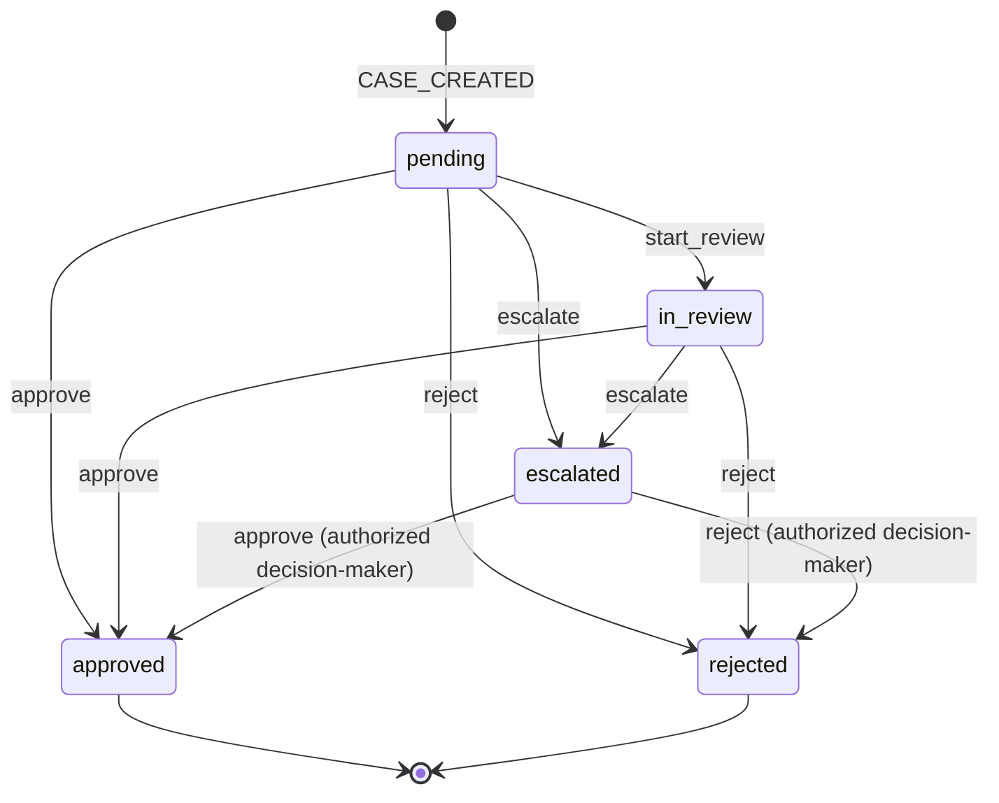

# KYC Review Console

Prototype internal tool for compliance analysts at a fictional Series C fintech. Analysts work a queue of KYC cases, inspect the customer profile and the risk signals that drove the score, and approve, reject or escalate each case; every decision is written to a tamper-evident audit trail. The project exists to evaluate whether Devin-built, version-controlled software can replace the company's Microsoft Power Apps internal tools. It is a prototype: see [`docs/ASSUMPTIONS.md`](docs/ASSUMPTIONS.md) for every shortcut taken and what production would require instead.

## Architecture

npm workspaces monorepo:

| Package | Role |
| --- | --- |
| `packages/server` | Express + better-sqlite3 API (TypeScript, ESM). Implements [`docs/API_CONTRACT.md`](docs/API_CONTRACT.md). Layered `http → services → domain (pure) → repo → SQLite`; see [`docs/ARCHITECTURE.md`](docs/ARCHITECTURE.md). |
| `packages/web` | Default UI: Vite + React 18 + react-router-dom SPA. Talks to the API over HTTP on `http://localhost:4000` (Vite proxies `/api/*`). |
| `variants/web-b`, `variants/web-c` | Alternative UI implementations evaluated during selection — see [`variants/README.md`](variants/README.md). |

### UI (`packages/web`)

Minimal SPA: a case queue at `/` and a case detail at `/cases/:id`, plain CSS, no UI kit or data-fetching library. The dev server runs on `http://localhost:5173` and proxies `/api/*` to the API on port 4000. The analyst identity is chosen from a header dropdown (persisted in localStorage) and sent as the `x-analyst-id` header. Production build emits `packages/web/dist/`.

Two alternative UIs were built and evaluated; they are kept as reference implementations under `variants/`:

- `variants/web-b` — component-library SPA: Tailwind CSS, shadcn-style primitives on Radix, TanStack Query + Table. Run: `npm run dev:web-b`.
- `variants/web-c` — server-rendered: Express SSR + React 19 + htmx on port 3000. Run: `npm run dev:web-c`.

web-a was selected as the default: same features, simplest stack, fewest dependencies.

## Prerequisites

- Node 20+ (`node -v`)
- npm 10 (`npm -v`) — workspaces support is required

## Setup and run

```bash
npm install          # installs all workspaces
npm run seed         # drop + recreate + populate packages/server/data/kyc.db (deterministic, idempotent)
npm run dev:server   # API on http://localhost:4000 (override with PORT)
npm run dev:web      # UI dev server on http://localhost:5173 (see UI section above)
```

Checks:

```bash
npm test             # vitest: server + web suites
npm run lint         # eslint: server + web
npm run typecheck    # tsc --noEmit: server + web
```

Per-variant equivalents exist for the alternative UIs (`npm run test:web-b`, `npm run typecheck:web-c`, etc.).

Environment variables (server): `PORT` (default `4000`), `KYC_DB_PATH` (default `packages/server/data/kyc.db`; `:memory:` supported).

Quick smoke test after `npm run dev:server`:

```bash
curl -s localhost:4000/api/health
curl -s 'localhost:4000/api/cases?riskLevel=high&pageSize=3' -H 'x-analyst-id: ana-003'
curl -s -X POST localhost:4000/api/cases/<id>/actions \
  -H 'content-type: application/json' -H 'x-analyst-id: ana-003' \
  -d '{"action":"start_review"}'
```

## Analyst workflow

1. **Queue** — `GET /api/cases` lists cases with status, risk level, score and customer summary; `GET /api/cases/stats` feeds the header counters.
2. **Filter** — by `status`, `riskLevel` (multi-value), free-text `q` (reference, customer name, email), sorted by `createdAt`, `updatedAt` or `riskScore`.
3. **Open case** — `GET /api/cases/:id` returns the full customer record, the risk signals, the audit history and `allowedActions` for the calling analyst.
4. **Review customer + risk signals** — verification flags, PEP/sanctions/adverse media, expected volume, source of funds.
5. **Act** — `POST /api/cases/:id/actions` with `start_review`, `approve`, `reject` or `escalate` (rules below). The response includes the updated case and audit trail.
6. **Audit history** — `GET /api/cases/:id/audit`, an ordered hash-chained list of every state change with actor and note.
7. **"Why is this case high risk?"** — `GET /api/cases/:id/risk-explanation` returns the score, the thresholds and each contributing factor with its weight and percentage contribution.

## Case state machine



Rules enforced by the domain layer (`packages/server/src/domain/transitions.ts`):

- `reject` and `escalate` require a trimmed note of 10–1000 characters.
- Every high-risk approval requires a 10–1000 character note, including escalated cases.
- Low/medium approvals require the same note by default; a compliance manager can change this through the Policy page. Optional notes remain capped at 1000 characters.
- Decisions from `pending`, `in_review`, and `escalated` use the role/risk matrix below. Terminal cases cannot be changed.
- Errors: `409 INVALID_TRANSITION`, `400 VALIDATION_ERROR`, `403 FORBIDDEN`, `401 UNAUTHORIZED`, `404 NOT_FOUND`.

## Risk scoring model

Deterministic: score = sum of triggered signal weights, clamped to 0–100. Level: `< 30` low, `30–59` medium, `≥ 60` high.

The prototype deliberately uses deterministic explanations. A production implementation could augment this with an LLM, but the system should retain structured evidence and deterministic policy evaluation as the source of truth.

This evaluation intentionally tests the AI-assisted layer over a working workflow rather than treating generated text as the workflow itself. Any future summary should point back to the recorded factors below; authorization, risk policy and case decisions remain deterministic.

That follows the same architectural direction as [Microsoft 365 Copilot over Dataverse](https://learn.microsoft.com/en-us/power-apps/maker/data-platform/data-platform-data-copilot): assistance sits over governed application data and respects the underlying access model. This prototype tests that seam with a deterministic explanation first, rather than pretending AI replaces the workflow.

| Code | Weight | Trigger |
| --- | --- | --- |
| `SANCTIONS_HIT` | 60 | Customer matches a sanctions list |
| `PEP` | 35 | Politically exposed person |
| `HIGH_RISK_JURISDICTION` | 25 | Residence or nationality in the high-risk list |
| `ADVERSE_MEDIA` | 10 per hit (max 30) | Adverse media hits |
| `ID_DOC_UNVERIFIED` | 20 | ID document not verified |
| `HIGH_EXPECTED_VOLUME` | 15 | Expected volume > 50k USD/month |
| `OPAQUE_SOURCE_OF_FUNDS` | 15 | Source of funds is `crypto`, `cash_intensive_business` or `unknown` |
| `ADDRESS_UNVERIFIED` | 10 | Address not verified |
| `CASH_INTENSIVE_OCCUPATION` | 10 | Cash-intensive occupation |
| `NEW_ACCOUNT` | 5 | Account opened < 30 days ago |

The explanation endpoint ranks the recorded case signals, identifies the primary driver and reports each factor's `contributionPct` relative to the raw signal total. The case page keeps descriptions and evidence-record IDs behind **View supporting evidence**. If the raw total exceeds 100, the displayed risk score remains capped at 100 while the explanation shows the uncapped total.

## Audit hash chain

Every state change appends one `audit_events` row per case with a monotonically increasing `sequence`. Each event stores `prevHash` (the previous event's `hash`, or 64 zeros for the first event) and

```
hash = sha256(prevHash + canonicalJson({ action, actorId, caseId, createdAt, fromStatus, note, sequence, toStatus }))
```

with keys in that fixed order. Each event records server-derived actor ID/name, action, case ID, timestamp, previous/new status and the trimmed note. SQLite triggers reject `UPDATE`/`DELETE`; recursive triggers also prevent `INSERT OR REPLACE` from overwriting history. There are no application routes to insert arbitrary events, edit them, or delete them, including for managers. Case changes and audit appends commit or roll back together.

Hash verification detects altered hashed fields and broken links. It cannot detect deletion of the chain tail or a privileged rewrite of the whole database, and the legacy case hash does not cover actor display names. Policy changes have a separate hash chain covering actor ID/name/role, reason and complete previous/new policy snapshots. Both chains remain in the operational database; external immutable storage and chain anchoring are production requirements.

## Identity model

There is no login. The **Demo identity** selector sends `x-analyst-id` on every API request. All sensitive reads and writes require a known ID (`401` for missing/unknown); only health is anonymous. The server loads roles from the database, never from request body or role headers, and re-resolves the actor within mutation transactions. New UI visitors start as `ana-003`, an analyst. Switching identity discards stale dialogs and data and aborts pending client requests; a request already committed server-side retains its original actor.

**This is enforced authorization with simulated identity, not production authentication.** Anyone able to call the API can choose a seeded manager ID. Before handling sensitive data, replace the selector/header with server-validated SSO sessions and provision roles through a controlled process.

Seeded identities:

| Id | Name | Role |
| --- | --- | --- |
| `ana-001` | Marta Ellison | `senior_analyst` |
| `ana-002` | Tommy Reyes | `senior_analyst` |
| `ana-003` | Grete Lindholm | `analyst` |
| `ana-004` | Kwame Osei | `analyst` |
| `ana-005` | Ines Morales | `analyst` |
| `ana-006` | Sofia Chen | `compliance_manager` |

`GET /api/me` returns the resolved identity and permissions; `GET /api/analysts` lists demo identities.

| Permission | Analyst | Senior analyst | Compliance manager |
| --- | --- | --- | --- |
| Read cases, risk information, audit history and policy | Yes | Yes | Yes |
| Start review / escalate | Yes | Yes | Yes |
| Approve/reject low or medium risk | No | Yes | Yes |
| Approve/reject high risk | No | No | Yes |
| Change policy | No | No | Yes |
| Modify/delete audit history | No | No | No |

The API returns `allowedActions` from the same role/risk/state rules used to authorize mutations. Denied requests do not change case state or decision history. All identities share the case queue; tenant, assignment and field-level restrictions are not implemented.

## Policy and existing databases

The Policy page controls whether low/medium approvals need a justification. Managers must provide a change reason and the current version; concurrent edits return `409 POLICY_CONFLICT`. Policy cannot relax high-risk role or note requirements. Every accepted policy update is audited in the same transaction.

Startup upgrades the old analyst-role constraint and creates the default policy without rewriting existing identities, cases or audit rows. Back up the database before upgrades. Existing databases do not automatically gain a manager account: provision one through trusted administrative access or use a separate freshly seeded demo database. `npm run seed` remains a **destructive demo reset**, including policy history; never use it to migrate retained records.

See [authorization and audit hardening](docs/SECURITY_REVIEW.md) for the before/after assessment, test coverage and remaining production work.

## Further reading

- [`docs/API_CONTRACT.md`](docs/API_CONTRACT.md) — endpoints, types, domain rules (authoritative)
- [`docs/ARCHITECTURE.md`](docs/ARCHITECTURE.md) — request flow, layering, transaction boundaries, how to build the next internal tool
- [`docs/ASSUMPTIONS.md`](docs/ASSUMPTIONS.md) — prototype assumptions vs production requirements; the Power Apps replacement question
