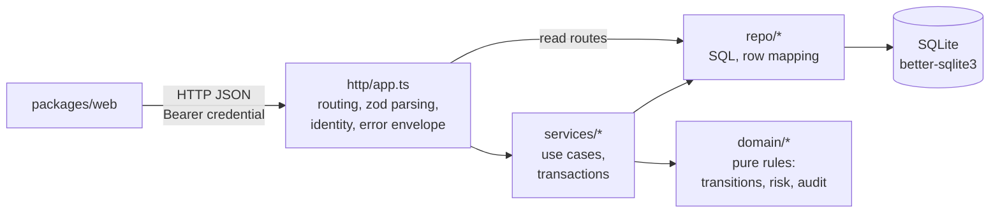

# Architecture

Scope: the shared KYC/refund API in `packages/server`, with client authentication boundaries.
The selected UI is `packages/web`; `variants/web-b` is a reference SPA and `variants/web-c`
is an Express/React SSR client. All three use the HTTP API rather than reading SQLite directly.

## Local sign-in adapter

`http/auth.ts → services/authService.ts → repo/credentials.ts + repo/sessions.ts`
verifies local passwords and issues revocable, expiring sessions. Passwords are salted scrypt
hashes; sessions are opaque bearer tokens with only SHA-256 hashes persisted. Successful session
creation/revocation and append-only authentication events commit atomically.

The API dev script explicitly sets `HOST=127.0.0.1` and `LOCAL_DEMO_AUTH=true` through
`cross-env`. Normal `start` sets neither: it honors the environment, defaults local authentication
off, and calls `app.listen(port)` without a host when `HOST` is unset. The startup log's
`localhost` label does not constrain that listener. Enabling local auth with
`NODE_ENV=production` throws; disabling it returns `404 LOCAL_AUTH_DISABLED` for `/api/auth`
requests and prevents existing demo sessions from authenticating. CORS preflight is handled
before those routes. This is a configuration guard, not a check that each caller is local.

The selected SPA's development-only Analyst / Reviewer / Admin picker requests
`GET /api/auth/demo-users`. That anonymous endpoint joins retained credentials to current
analysts, selects the first credential by analyst ID for each role, and returns its name/email
under a picker ID. Missing roles are omitted. The SPA submits that email and the public demo
password to `/api/auth/sign-in`, then installs the identity from `/api/me`. The label/analyst ID
does not authenticate a request. Anyone who can reach the enabled adapter can obtain the
mapping and sign in with the public seeded password, including as a manager.

Both SPAs store only session tokens in `sessionStorage` and restore identity through `/api/me`.
Fresh reference-SPA sign-in uses the server's sign-in response; the extra `/api/me` check during
sign-in is specific to the selected picker's flow. SSR stores the token in an HttpOnly,
SameSite=Strict cookie (Secure by default), then resolves `/api/me` on protected page requests.
Its cookie name defaults to `kyc_session_<PORT>`; cookies themselves are not scoped by port or
tab. Distinct names support local instance demos, not isolation from untrusted same-host apps.
The SPA storage areas differ by origin and tab, but duplicated/opener-created tabs can inherit
a token and JavaScript can read it. None of these clients creates a separate database or RBAC
boundary. Automation tokens remain a separate credential type.

The selected SPA uses `credentials: 'same-origin'` to preserve preview/proxy cookies and
`redirect: 'error'`; the API still derives application identity only from its bearer header.

Production SSO/OIDC would need an adapter into the server-resolved analyst context and
downstream authorization. Identity-provider integration and managed role provisioning are
not implemented; the SSR cookie adapter is not a complete production BFF/session boundary.

Sources: [`http/auth.ts`](../packages/server/src/http/auth.ts),
[`http/app.ts`](../packages/server/src/http/app.ts),
[`server scripts`](../packages/server/package.json), [`index.ts`](../packages/server/src/index.ts),
[`selected SPA client`](../packages/web/src/api/client.ts),
[`reference SPA session`](../variants/web-b/src/lib/authSession.ts),
[`SSR app`](../variants/web-c/src/app.tsx).

## Request flow



Example: `POST /api/cases/:id/actions`

1. `http/app.ts` authenticates the bearer credential against its stored hash and expiry, then resolves the current analyst. Revocation removes the hash. Missing/invalid credentials return `401`; an optional mismatched `x-analyst-id` returns `403`. The body is parsed with `actionBodySchema` (zod).
2. `services/caseService.applyCaseAction(db, caseId, actor, action, note)` opens an immediate transaction, reloads the actor's stored identity and role, and reads the current policy.
3. Inside it, `domain/transitions.validateAction` combines legal transitions, role/risk permissions and policy note requirements — no I/O.
4. `repo/cases.updateCaseStatus`, then `domain/audit.computeEventHash` over the previous event's hash, then `repo/audit.insertAuditEvent`.
5. The transaction commits; the service returns `{ case, audit, allowedActions, approvalNoteRequired }`. The HTTP response spreads the case fields at the top level alongside `audit`, `allowedActions` and `approvalNoteRequired`.

`PUT /api/policy` requires `policy:manage`, a change reason and the current version. `policyService` reloads the actor, validates permission/version, and commits the updated setting with a hash-linked before/after audit event in one immediate transaction. High-risk decision permissions and note requirements are fixed in the authorization domain and cannot be relaxed by this setting.

The selected SPA and SSR client use the API's `approvalNoteRequired` flag. Reference web-b still
uses older [local note rules](../variants/web-b/src/lib/actionRules.ts): it allows an empty
low/medium approval note and accepts a high-risk approval note with one trimmed character.
Its [dialog](../variants/web-b/src/components/ActionDialog.tsx) does not consume the policy flag,
so API validation can reject submissions that its local validator accepts. The server enforces
the current policy and the 10–1000 character requirement; client behavior is not uniform.

Risk-scoring policy is separate: `PUT /api/risk-policy` calls `riskPolicyService`, with the same
identity and manager permission. Its transaction saves rule weights/thresholds, re-evaluates open
cases, captures thresholds in `case_risk_thresholds`, appends case audit events for changed
evaluations, and records independent versioned field differences in `risk_policy_changes`.
Approval-note settings and refunds are unaffected. A no-op patch returns `change: null` without
rescoring. Effective patches examine pending, in-review and escalated cases; only changed
scores, levels, evidence or thresholds produce `RISK_RESCORED` case events and count toward
`recomputedCases`. Closed cases keep their saved evaluation; explanation reads never apply the
current policy or clock. Risk-policy history is append-only but is not hash-chained and does
not require a reason or client version. Evaluations without a threshold row, including initial
full-seed cases, use the default 30/60 thresholds.

## Module responsibilities

| Layer | Path | Current responsibility |
| --- | --- | --- |
| http | `src/http/app.ts`, `auth.ts`, `refunds.ts` | App/router factories, zod parsing, bearer identity, permission middleware, security headers/CORS and error mapping; read routes call repositories/domain functions directly |
| services | `src/services/*` | Mutation orchestration, current-actor checks, transactions, domain-error-to-HTTP-status mapping; auth service also owns in-process throttling |
| domain | `src/domain/*` | Permission/transition rules, risk evaluation/explanations, policy schemas and audit hashing; `password.ts` also uses randomness and synchronous scrypt |
| repo | `src/repo/*` | SQL, row mapping, pagination and persistence; credential/session/token repositories also use domain helpers and open transactions |
| db / schema | `src/db.ts`, `src/schema.sql`, `src/schema.ts`, `src/migrations.ts` | Database opening, schema creation, legacy upgrades and append-only triggers |
| seed | `src/seed.ts`, `src/seedLogins.ts`, `src/seedRefunds.ts` | Full reset and separate credential/refund provisioning commands |
| types / errors | `src/types.ts`, `src/errors.ts` | Shared server contracts and `ApiError(status, code, message, details?)` |

Business-rule functions do not depend on Express or SQLite. This is a module convention, not
an enforced strictly downward dependency graph: HTTP reads bypass services, repositories
import domain helpers, and domain modules share `types.ts`.

## Database, migrations and audit structures

[`openDb`](../packages/server/src/db.ts) uses `KYC_DB_PATH` or
`packages/server/data/kyc.db`, enables WAL for file databases, and enables foreign keys and
recursive triggers. It applies `schema.sql` and then the three migrations in
[`migrations.ts`](../packages/server/src/migrations.ts): widen the analyst-role constraint,
expand audit subjects to refunds, and add nullable `customers.id_document_expires_at` if absent.
The first two preserve existing row values/hashes and check foreign keys. Each migration has
its own transaction; bootstrap is not one versioned, all-or-nothing migration run.

The schema includes analysts/customers, cases, risk signals, per-case threshold snapshots,
refunds, two policy stores and four history tables. Their audit guarantees differ:

| Store | Contents and hash coverage |
| --- | --- |
| `audit_events` | Exactly one case or refund subject per row, with a separate sequence and hash chain per subject. Hashes cover subject ID, sequence, actor ID, action, statuses, note and time plus the previous hash. Event ID and actor display name are stored but not hashed; actor role and decision-time policy version are not dedicated fields. |
| `policy_audit_events` | Separate approval-note policy chain covering event ID, actor ID/name/role, action, reason, timestamp and complete before/after snapshots, linked by previous hash. |
| `risk_policy_changes` | Independently increasing version, actor ID/name, field differences, changed-case count and time; no hash, actor role or required reason. |
| `auth_events` | Sign-in success/failure/throttling and sign-out metadata; no hash chain or public read endpoint. |

All four histories reject SQL updates/deletes. On connections opened by `openDb`, recursive
triggers make replace-style deletes hit those protections; risk-policy history also has an
explicit duplicate-ID/version insert trigger. These controls do not prevent an administrator
from changing the schema or rewriting the database. Hash verification checks supplied links
and covered fields; it cannot establish external completeness or detect tail removal.
See [`schema.sql`](../packages/server/src/schema.sql),
[`domain/audit.ts`](../packages/server/src/domain/audit.ts) and
[`domain/policy.ts`](../packages/server/src/domain/policy.ts).

`npm run seed` destructively recreates business, policy, audit, credential and session tables,
then seeds KYC, refunds and demo logins. Its PRNG seed is fixed, but dates use the current
clock, event/signal IDs use UUIDs and passwords use random salts. `seed:logins` replaces
credentials for existing analysts and revokes their browser sessions transactionally while
retaining business data, auth history and automation tokens; it does not add missing roles.
`seed:refunds` adds missing fictional refund IDs without rewriting existing decisions/history.
Full seeding and login seeding reject `NODE_ENV=production`; refund-only seeding has no such
environment guard and instead checks fictional customer ID/email conventions. None is an
HTTP endpoint or part of routine startup.

## Recorded risk explanations

The explanation endpoint uses the case's recorded score, level, threshold snapshot (or default
fallback) and risk-signal rows. It ranks those
saved factors, identifies the primary driver and exposes each evidence-record ID. This avoids
re-evaluating time-dependent rules when an analyst opens an older case. Contribution percentages use
the raw signal total; if that total exceeds 100, the response also explains that the saved risk score
was capped. New or changed scoring policy must create a new evaluation rather than silently changing
the explanation of an existing case. Effective risk-policy changes do this for open cases in
one transaction, replacing changed signal rows and updating threshold snapshots. Old signal
sets are not retained as complete evaluation versions; a case audit note records the policy
version, old/new score, level and thresholds, and whether evidence changed.

The rule predicates and code defaults live in `domain/risk.ts` and `domain/riskPolicy.ts`.
`repo/riskPolicy.ts` loads persisted weights/thresholds, falling back to code defaults for missing
keys. No timed/background rescore runs when an account ages or a document expires.

Deterministic policy evaluation and recorded evidence remain authoritative. A production system may
add an LLM-written summary, but that summary should reference this structured result and must not
replace its score, factor weights or evidence links.

## Why business rules are pure functions

`validateAction`, `getAllowedActions`, `computeRisk*` and `computeEventHash` take plain values and return plain values. Consequences:

- Table-driven tests (`domain/*.test.ts`) cover transition × role × risk combinations without a database.
- API read responses and writes share permission/transition rules. A UI can still become stale between requests or implement older local validation; writes recheck the current role, state, risk and note policy.
- Managers can change configured weights without a code edit. Adding a predicate or role still requires coordinated domain, schema/type and test changes.
- Plain-value rule inputs support reuse; Node crypto helpers and module dependencies still need consideration before moving code into a browser.

Services orchestrate state reads, rule evaluation and writes; repositories perform SQL and
some credential-generation work.

## Transaction boundaries

Case actions, refund decisions and both policy mutations use immediate service transactions.
Case actions cover: reload actor → read case/policy → validate → update case → append audit →
re-read case. Writes are serialized and the next action checks committed state (`409
INVALID_TRANSITION` when no longer legal). Approval-note writes additionally enforce the client's
version (`409 POLICY_CONFLICT`). Risk-policy patches and case/refund requests have no client
version or idempotency key.

Sign-in verifies the password before its session-plus-auth-event transaction; sign-out deletes
the session and appends an event atomically when a row is revoked. Session/token/credential
repositories also open transactions, sometimes nested within a service transaction. Session
authentication itself opens an immediate transaction to update idle activity or remove an
expired row, including on API GETs. Business read handlers do not wrap their multiple reads in a
snapshot transaction. The full seed reset is not atomic with all later fixture writes.

## Error envelope

The final Express error handler maps `ApiError` to the JSON envelope below, maps `SyntaxError`
to `400 VALIDATION_ERROR`, and maps other errors to a generic `500 INTERNAL`:

```json
{ "error": { "code": "INVALID_TRANSITION", "message": "Cannot perform 'approve' on a case with status 'approved'." } }
```

| Status | Code | Source |
| --- | --- | --- |
| 400 | `VALIDATION_ERROR` | zod parse failure (details contains issues) or domain note rules |
| 401 | `UNAUTHORIZED` | missing, malformed, unknown, expired or revoked bearer credential |
| 401 | `INVALID_CREDENTIALS` | incorrect local sign-in email/password |
| 403 | `FORBIDDEN` | role not allowed for the transition |
| 404 | `NOT_FOUND` | unknown case or route |
| 404 | `LOCAL_AUTH_DISABLED` | local authentication routes when the adapter is disabled |
| 409 | `INVALID_TRANSITION` | action not valid from the current status |
| 409 | `POLICY_CONFLICT` | supplied policy version is stale |
| 429 | `TOO_MANY_ATTEMPTS` | local sign-in throttle |
| 500 | `INTERNAL` | unexpected errors; the handler does not log a stack |

Transition validators return `{ ok: false, error: { code, message } }`; services map their codes
to HTTP statuses. Other helpers can throw. JSON parsers limit auth bodies to 2 KB and other
JSON bodies to 50 KB, but parser errors other than `SyntaxError` are not separately mapped
(including oversized-body errors). Protected `/api` requests authenticate before the main
JSON parser and route lookup, so anonymous unknown API routes return `401`, not necessarily
`404`. Local sign-out is idempotent and returns `204` for a missing/unknown token when its
handler completes; it does not require the main identity middleware.

## How to add the next internal tool

Refunds demonstrates an additional internal tool within this repository.
Keep the existing shell, identity middleware, API, database and audit machinery; add only the next
tool's domain, persistence and routes. The [refund portfolio report](REFUNDS_PORTFOLIO.md) records
which parts were reused and which needed extraction.

**Workspace layout**

```
package.json             # workspaces: packages/*, variants/*; root scripts delegate with -w
tsconfig.base.json       # shared strict TS config
docs/API_CONTRACT.md     # write this first; it is the spec the API and UI are built from
packages/server/src/
  http/       services/       domain/       repo/       db.ts  schema.sql  seed.ts  types.ts  errors.ts
packages/web/
```

**Steps**

1. Write an additive domain API contract, as in `docs/REFUNDS_API.md`: entities, enums, endpoints, validation and state rules, error codes, seed expectations.
2. Define `types.ts` from the contract and `schema.sql` from the types, with a migration for retained databases. Add append-only triggers for any audit log and specify which fields are hashed.
3. Implement `domain/` first as pure functions with table-driven tests. If a rule needs the database, it belongs in a service, not the domain.
4. Implement `repo/` as thin prepared-statement wrappers with one mapper per table.
5. Implement `services/` use cases; one transaction per mutating use case.
6. Implement `http/app.ts` as `createApp(db)` so tests can instantiate it with `openDb(':memory:')`. Validate every body and query string with zod at the edge.
7. Add deterministic fictional fixtures with a non-destructive additive command. Keep full demo resets explicit and separate from startup migrations.
8. Tests at three levels: domain (pure), service (in-memory SQLite), HTTP (supertest against `createApp`). Keep them in `*.test.ts` beside the code.
9. Reuse the credential authentication and server permission/service boundaries. Before handling sensitive data, add managed SSO and controlled provisioning. See `ASSUMPTIONS.md` and `SECURITY_REVIEW.md` for the remaining platform work.

**Shared now:** `ApiError` + error handler, database-resolved identity, permission catalog, audit
hashing/storage, database bootstrap, and pagination shape `{ items, total, page, pageSize }`.
The UI shares `DataTable`, `SearchInput`, `FilterChips`, `Pagination`, `ActionDialog`, `AuditTimeline`,
the analyst provider and API request/cancellation path. There is no separate framework package:
both tools are modules in the same application. Transition functions remain small domain modules
using the same pure validation and transactional service pattern.
