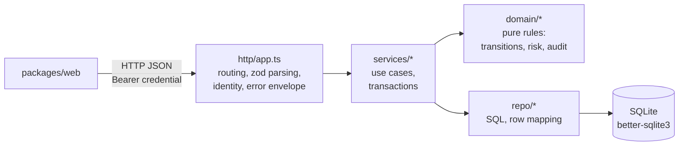

# Architecture

Scope: `packages/server`. The UI (`packages/web`) is a separate workspace that only talks to the HTTP API.

## Local sign-in adapter

`http/auth.ts → services/authService.ts → repo/credentials.ts + repo/sessions.ts`
verifies local passwords and issues revocable, expiring sessions. Passwords are salted scrypt
hashes; sessions are opaque bearer tokens with only SHA-256 hashes persisted. Successful session
creation/revocation and append-only authentication events commit atomically.

The adapter is explicitly enabled in the dev command and prohibited in production. Both SPAs
use tab/origin-scoped sessionStorage and restore actor/role from `/api/me`; the SSR adapter holds
the same session in an HttpOnly cookie. Instance isolation changes credential storage, not the
shared server RBAC, domain services or business audit architecture. Existing automation tokens
remain a separate credential type.

Production SSO/OIDC can replace the local credential verification/transport while reusing the
server-resolved analyst context and downstream authorization. Identity-provider integration,
managed role provisioning and a BFF/cookie security boundary are not implemented here.

## Request flow



Example: `POST /api/cases/:id/actions`

1. `http/app.ts` authenticates the bearer credential against its stored hash and expiry, then resolves the current analyst. Revocation removes the hash. Missing/invalid credentials return `401`; an optional mismatched `x-analyst-id` returns `403`. The body is parsed with `actionBodySchema` (zod).
2. `services/caseService.applyCaseAction(db, caseId, actor, action, note)` opens an immediate transaction, reloads the actor's stored identity and role, and reads the current policy.
3. Inside it, `domain/transitions.validateAction` combines legal transitions, role/risk permissions and policy note requirements — no I/O.
4. `repo/cases.updateCaseStatus`, then `domain/audit.computeEventHash` over the previous event's hash, then `repo/audit.insertAuditEvent`.
5. The transaction commits; the service returns `{ case, audit, allowedActions, approvalNoteRequired }`; the HTTP layer serialises it.

`PUT /api/policy` requires `policy:manage`, a change reason and the current version. `policyService` reloads the actor, validates permission/version, and commits the updated setting with a hash-linked before/after audit event in one immediate transaction. High-risk decision permissions and note requirements are fixed in the authorization domain and cannot be relaxed by this setting.

Risk-scoring policy is separate: `PUT /api/risk-policy` calls `riskPolicyService`, with the same
identity and manager permission. Its transaction saves rule weights/thresholds, re-evaluates open
cases, captures thresholds in `case_risk_thresholds`, appends case audit events for changed
evaluations, and records independent versioned field differences in `risk_policy_changes`.
Approval-note settings and refunds are unaffected. Closed cases keep their saved evaluation;
explanation reads never apply the current policy or clock. Risk history is append-only but is
not hash-chained. Legacy evaluations without snapshots use the original 30/60 thresholds.

## Module responsibilities

| Layer | Path | Owns | Must not |
| --- | --- | --- | --- |
| http | `src/http/app.ts` | Express app factory `createApp(db)`, routes, request validation (zod), identity middleware, security headers/CORS, error → envelope mapping | Contain business rules or SQL |
| services | `src/services/*` | Use cases: load state, call domain, persist, define transaction boundaries, translate domain error codes to `ApiError` statuses | Format HTTP responses; compute rules inline |
| domain | `src/domain/*` | Pure functions and types: `transitions.ts` (allowed actions, validation), `risk.ts` (score, level, explanation), `audit.ts` (canonical hash, chain verification) | Import `db`, Express, or anything with I/O |
| repo | `src/repo/*` | Prepared statements, row ↔ type mapping (`mappers.ts`), list/filter/paginate SQL | Make decisions; throw domain errors |
| db / schema | `src/db.ts`, `src/schema.sql`, `src/schema.ts` | Open the database (`KYC_DB_PATH`, WAL, foreign keys), apply schema idempotently, append-only triggers on `audit_events` | — |
| seed | `src/seed.ts` | Deterministic fixture generation (`kyc-demo-2026`), drops and recreates | Be imported by runtime code |
| types / errors | `src/types.ts`, `src/errors.ts` | Contract types mirroring `docs/API_CONTRACT.md`; `ApiError(status, code, message, details?)` | — |

Dependency direction is strictly downward: `http → services → {domain, repo} → db`. Domain has no dependencies on other layers.

## Recorded risk explanations

The explanation endpoint uses the case's recorded score, level and risk-signal rows. It ranks those
saved factors, identifies the primary driver and exposes each evidence-record ID. This avoids
re-evaluating time-dependent rules when an analyst opens an older case. Contribution percentages use
the raw signal total; if that total exceeds 100, the response also explains that the saved risk score
was capped. New or changed scoring policy must create a new evaluation rather than silently changing
the explanation of an existing case.

Deterministic policy evaluation and recorded evidence remain authoritative. A production system may
add an LLM-written summary, but that summary should reference this structured result and must not
replace its score, factor weights or evidence links.

## Why business rules are pure functions

`validateAction`, `getAllowedActions`, `computeRisk*` and `computeEventHash` take plain values and return plain values. Consequences:

- Tests are table-driven and instant (`domain/*.test.ts`); the full transition × role × risk matrix is covered without a database.
- The same functions serve both the write path (validate before persisting) and the read path (`allowedActions` in `GET /api/cases/:id`), so UI and API can never disagree about what is permitted.
- Changing a rule (a new weight, a new role) is a one-file diff with an obvious test to update.
- The rules could be moved to a UI bundle or another service unchanged.

Services are where impurity lives: they read current state, call the pure functions, and write results.

## Transaction boundaries

Every mutating use case uses `db.transaction(() => ...).immediate()` in the service layer. Case actions cover: reload actor → read case/policy → validate → update case → append audit → re-read case. Writes are serialized and the next action is checked against committed state (`409 INVALID_TRANSITION` when no longer legal). Approval-note writes additionally enforce the client's version (`409 POLICY_CONFLICT`). Risk-policy patches and case requests do not yet include a client version. Reads do not open explicit transactions.

The rule: if a use case writes more than one row, or writes and then reads back, it belongs in a service function wrapped in a transaction. Repos never open transactions.

## Error envelope

All errors are `ApiError` instances converted by the final Express error handler to

```json
{ "error": { "code": "INVALID_TRANSITION", "message": "Cannot perform 'approve' on a case with status 'approved'." } }
```

| Status | Code | Source |
| --- | --- | --- |
| 400 | `VALIDATION_ERROR` | zod parse failure (details contains issues) or domain note rules |
| 401 | `UNAUTHORIZED` | missing, malformed, unknown, expired or revoked bearer credential |
| 403 | `FORBIDDEN` | role not allowed for the transition |
| 404 | `NOT_FOUND` | unknown case or route |
| 409 | `INVALID_TRANSITION` | action not valid from the current status |
| 409 | `POLICY_CONFLICT` | supplied policy version is stale |
| 500 | `INTERNAL` | anything unexpected; message is generic, stack is logged server-side |

Domain functions return `{ ok: false, error: { code, message } }` rather than throwing; the service maps the code to a status. This keeps the domain free of HTTP concepts.

## How to add the next internal tool

The company expects 10+ more internal apps. Refunds is the first extension within this repository.
Keep the existing shell, identity middleware, API, database and audit machinery; add only the next
tool's domain, persistence and routes. The [refund portfolio report](REFUNDS_PORTFOLIO.md) records
which parts were reused and which needed extraction.

**Workspace layout**

```
package.json             # workspaces: packages/*, variants/*; root scripts delegate with -w
tsconfig.base.json       # shared strict TS config
docs/API_CONTRACT.md     # write this first; it is the spec the API and UI are built from
packages/server/src/
  http/       services/       domain/       repo/       db.ts  schema.sql  seed.ts  types.ts  errors.ts
packages/web/
```

**Steps**

1. Write an additive domain API contract, as in `docs/REFUNDS_API.md`: entities, enums, endpoints, validation and state rules, error codes, seed expectations.
2. Define `types.ts` from the contract and `schema.sql` from the types. Add append-only triggers for any table that is an audit log.
3. Implement `domain/` first as pure functions with table-driven tests. If a rule needs the database, it belongs in a service, not the domain.
4. Implement `repo/` as thin prepared-statement wrappers with one mapper per table.
5. Implement `services/` use cases; one transaction per mutating use case.
6. Implement `http/app.ts` as `createApp(db)` so tests can instantiate it with `openDb(':memory:')`. Validate every body and query string with zod at the edge.
7. Add deterministic fictional fixtures with a non-destructive additive command. Keep full demo resets explicit and separate from startup migrations.
8. Tests at three levels: domain (pure), service (in-memory SQLite), HTTP (supertest against `createApp`). Keep them in `*.test.ts` beside the code.
9. Reuse the credential authentication and server permission/service boundaries. Before handling sensitive data, add managed SSO and controlled provisioning. See `ASSUMPTIONS.md` and `SECURITY_REVIEW.md` for the remaining platform work.

**Shared now:** `ApiError` + error handler, database-resolved identity, permission catalog, audit
hashing/storage, database bootstrap, and pagination shape `{ items, total, page, pageSize }`.
The UI shares `DataTable`, `SearchInput`, `FilterChips`, `Pagination`, `ActionDialog`, `AuditTimeline`,
the analyst provider and API request/cancellation path. There is no separate framework package:
both tools are modules in the same application. Transition functions remain small domain modules
using the same pure validation and transactional service pattern.
